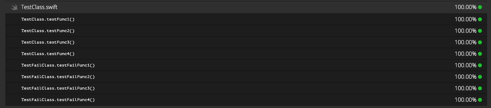
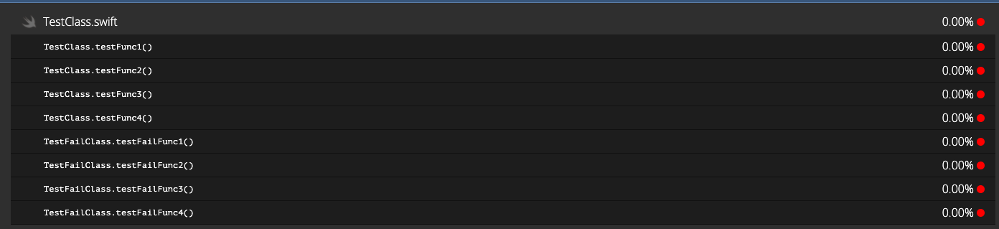
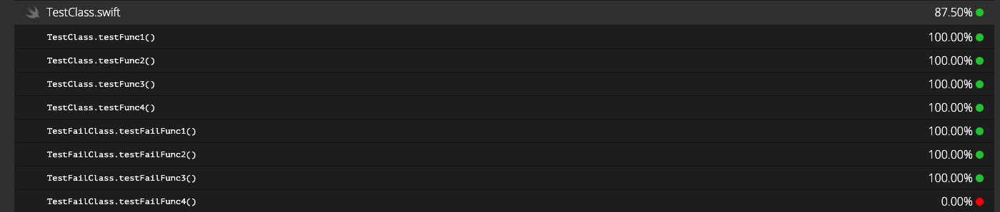

multi_scan coverage test app
==================

This project is meant to demonstrate a bug in multi_scan and code coverage reporting when a test fails and multi_scan retries multiple times. According to this issue (https://github.com/lyndsey-ferguson/fastlane-plugin-test_center/issues/33) multi_scan should ignore test coverage reports after the initial test run fails.

This project has 2 very simple classes `TestFailClass` and `TestClass`. They both consist of functions that print the name of the function. The test file `testCoverageTests` runs some very basic tests on all of these functions by simply calling them. In this file there is a commented function `testFailClass4` which is what I'm using to test the different results. The project also has a podfile and 1 pod, this pod is not used and was only included to mimic a project with an `.xcworkspace` file

For all 3 runs, I am running the following 2 commands:

`bundle exec fastlane test`

`xcov -w ./testCoverage.xcworkspace -s testCoverage -o xcov_output`

Test 1 - All tests succeed on first try
==================
This works as expected.

Test 2 - `testFailClass4` and we allow 3 tries
==================
This does not work as expected. Because multi_scan should only care about the first run for coverage, I would expect the same results here as in Test 3 but it seems the entire coverage is lost.

Test 3 - `testFailClass4` and we allow 1 try
==================
This works as expected, all functions show coverage except the one tested by the failing test.

